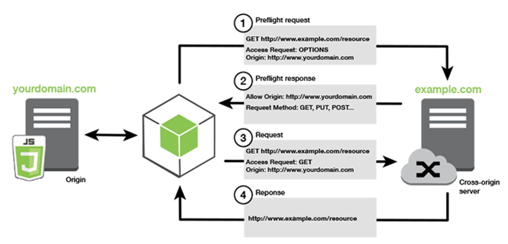
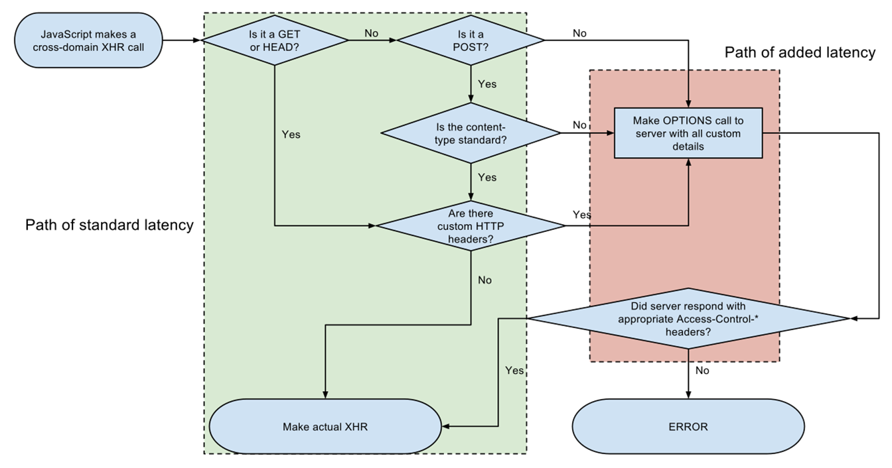

# 7.2 Unprotected API Defense

- Consistent Input Validation to validate during code reviews.
- API Authentication gateway to secure authentications (OAuth)
- API Management platform allow security features like:
    - Rate limiting and quota policies against service availability threats.
    - Audit changes in API management systems against insider threats.
    - Track logs of API attempts to detect spam and crawlers abuse.
- Browsers 
- Framework & Custom implementation

## Implementation

HTML5's technologies : Same-origin policy (SOP), Content Security Policy (CSP), Cross-Origin Resource Sharing (CORS)
Protection based on custom implementation: Filters, Interceptors, Annotations (JSR-250, spring-security, …), Insecure Direct Objects Reference (IDOR)
Hide template portions depending on user profile: 
- Mitigation (not a protection!)
- Combined with server-side API protection
- Client-side implementation : ngIf directive or dedicated module (ng2Shiro, sdco-angular-shiro, …)

## Cross-origin resource sharing (CORS)

Allows restricted resources on a web page to be requested from another domain outside the domain from which the first resource was served.

Request headers:

- Origin
- Access-Control-Request-Method
- Access-Control-Request-Headers

Response headers:

- Access-Control-Allow-Origin
- Access-Control-Allow-Credentials
- Access-Control-Expose-Headers
- Access-Control-Max-Age
- Access-Control-Allow-Methods
- Access-Control-Allow-Headers

