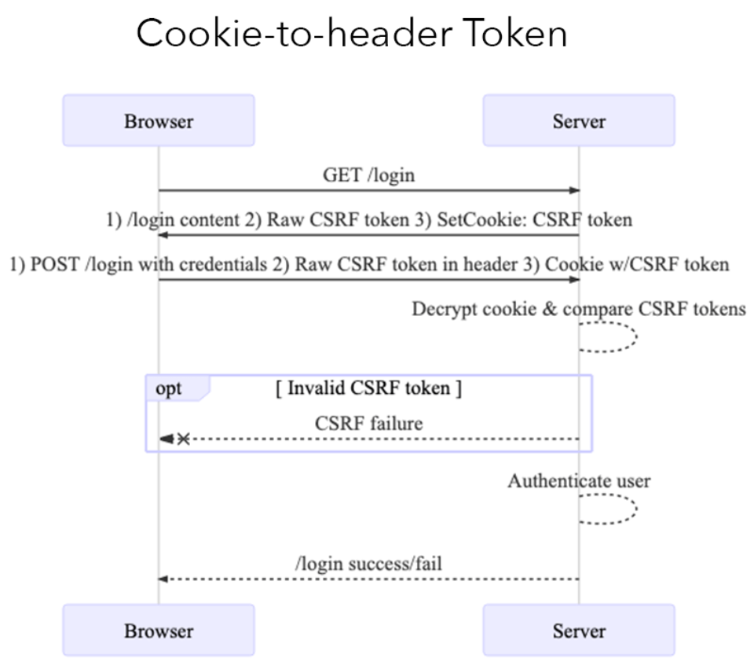

# 2.4 CSRF Protection in Angular 

What are the defense mechanisms against CSRF available in Angular ?

## Built-in prevention

Angular has a built-in CSRF prevention mechanism called cookie-to-header token.
It is a mix of 2 protection patterns : "Double submit cookie" and "Custom header" 

## cookie-to-header workflow

1. After authentication, the server-side sends a random CSRF token in a cookie.
2. Angular reads the token from the cookie.
3. Angular puts token in request header.
4. For each request, the browser sends the cookie and the request header.
5. Server extract and compares both tokens received from the client.
6. Server decides to verify the action only if the tokens match.



::: warning
CSRF prevention needs to be implemented in both your server (back-end) side, and your client (front-end) side.

As Angular provides solution as a client, you must investigate your back-end framework in order to generate and handle the random CSRF token.
:::

## Configuring CSRF protection in Angular

Angular `HttpClientModule` has a built-in CSRF protection enabled by default.

For a server that supports a cookie-based CSRF protection system, use `HttpClientXsrfModule` (in the import section of the module where your components are declared) to configure the XSRF protection (cookie name, header name, ...) or to disable it.

``` typescript
imports:[
HttpClientModule,
HttpClientXsrfModule.disable()
]
```

By default, your application will automatically send the cookie `cookieName: 'XSRF-TOKEN'`, and the header `headerName: 'X-XSRF-TOKEN'` for each request sent from this component. If you want to customize the setting (to match server's cookie name for instance) :

``` typescript
imports: [
HttpClientModule,
HttpClientXsrfModule.withOptions({
cookieName: 'your-custom-Xsrf-Cookie',
headerName: 'your-custom-Xsrf-Header'
})
]
```

The CSRF module implements the default interceptor HttpXsrfInterceptor.

## Further resources

[owasp.org/www-community/attacks/csrf](https://owasp.org/www-community/attacks/csrf)
[angular.io/guide/http#security-xsrf-protection](https://angular.io/guide/http#security-xsrf-protection)
