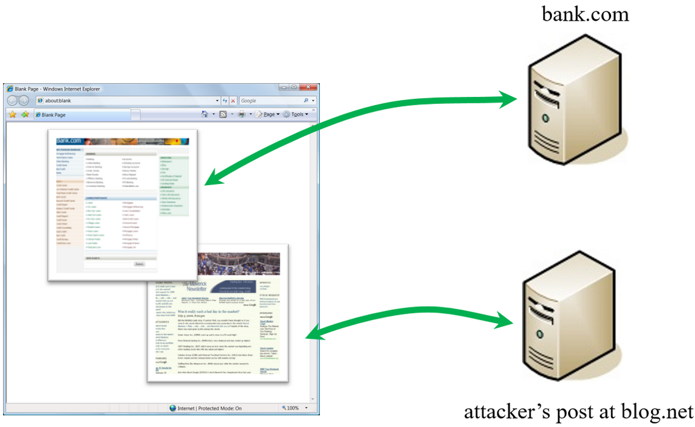
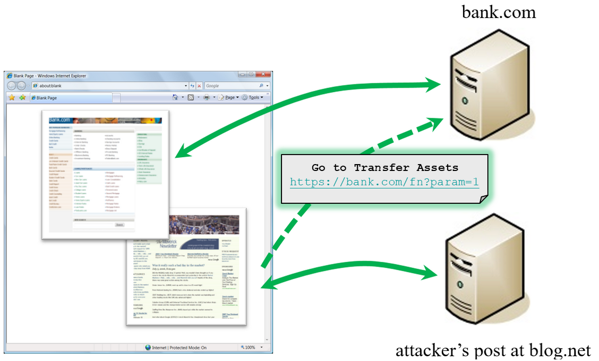
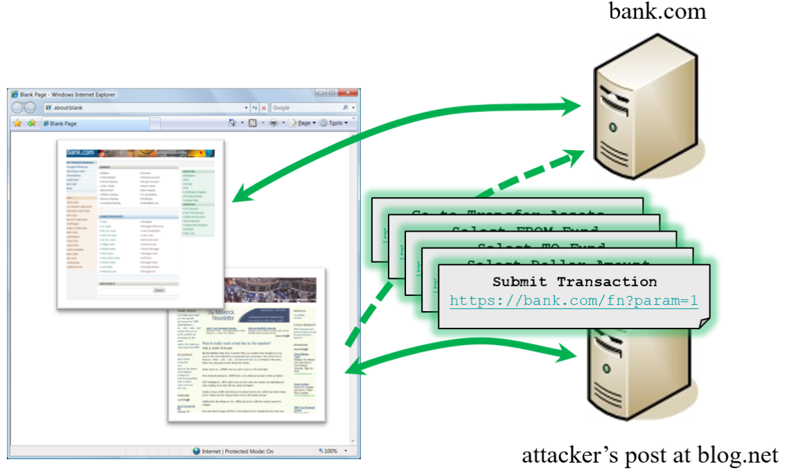

# 2.1 CSRF Overview

## CSRF in a nutshell

CSRF (Cross-Site Request Forgery) is an attack where a malicious website causes a logged-on user’s web browser to **perform an unwanted action on a trusted site**.

## Why CSRF can be dangerous ?

A successful CSRF attack can **force the user** to perform state changing requests like transferring funds, changing their email address, and so forth. If the victim is an **administrator account**, CSRF can **compromise the entire web application**.

## What are CSRF famous real life cases ?

- **[TikTok](https://www.zdnet.com/article/tiktok-patches-reflected-xss-bug-one-click-account-takeover-exploit/)** : In 2020, a vulnerability that allowed attackers to send messages containing malware to Tiktok users. The attackers could perform CSRF or cross-site scripting (XSS) attacks, causing other user accounts to submit requests on their behalf to the TikTok application.

- **[Netflix](https://appsecnotes.blogspot.com/2009/01/netflix-csrf-revisited.html
  )** : In 2006, Netflix website had numerous vulnerabilities regarding CSRF, which could have allowed any attacker to perform actions such as adding a DVD to the victim’s rental queue, changing the shipping address on the account, or altering the victim’s login credentials to fully compromise the account.

- **[ING Direct](https://people.eecs.berkeley.edu/~daw/teaching/cs261-f11/reading/csrf.pdf
  )** : In 2008, ING Direct, the banking website of a Dutch-owned multinational banking group, had a CSRF vulnerability that allowed attackers to transfer money from users’ accounts, even though users were authenticated with SSL. The website did not have any protection against CSRF attacks, and the process of transferring funds was easy for attackers to see and replicate.

## What makes CSRF attacks possible ?

Browser requests automatically **include all cookies including session cookies**. The attackers use **social engineering** to trick users which browsers cannot distinguish between **legitimate authorized requests** and **forged authenticated requests**.

