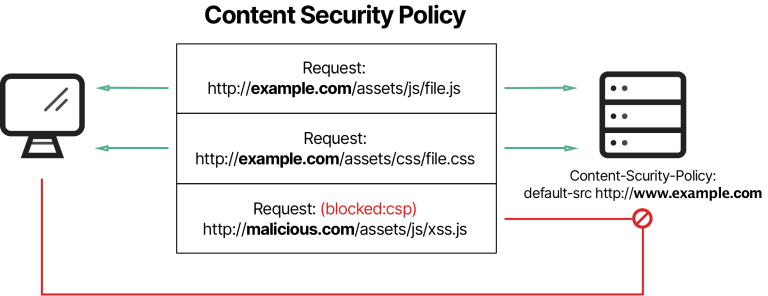

# 4.1 CSP Overview



Content Security Policy (CSP) is a W3C standard introduced to prevent cross-site-scripting, click-jacking and other code injection attacks resulting of malicious inputs in the trusted web page context.
CSP defines a standard methods for web application developers to declare approved origins of content that browsers should allow loading.

**CSP is a new browser security policy** :
- Defines what it is allowed to happen in a page
- Delivered by the server in a response header or meta tag 


::: warning
CSP is not intended as a first level of defense against code injection attacks like XSS. CSP is best used as defense-in-depth. 
It reduces the risk that malicious injection can cause, but it is not a replacement for careful input validation and output encoding.
:::

## Implementation

To enable CSP, you need to configure your web application to return the `Content-Security-Policy` HTTP header.


## CSP evolution to strict CSP

white-list CSP properties requires a lot of customization and maintenance.

CSP evolution with `script-src` directive :


A **nonce** is a random number generated for single usage to mark a `<script>` tag as trusted.

::: warning
Browsers still not support all CSP version 3 features.
Most recent browsers version support CSP version 2.
:::

## CSP common directives

- `default-src` : Default property if no other attributes are defined. In most cases, the value of this property is `default-src 'self'`  meaning the browser can only upload resources from the current website. 
  
- `script-src` : Defines locations from which external scripts can be loaded. If your web application does not use client-side scripting, set the value to `script-src 'none'`.
    
- `img-src` : Defines locations from which images can be retrieved.
    
- `media-src` : Defines locations from which rich media like video can be retrieved.
    
- `object-src` : Defines locations from which plugins can be retrieved.
    
- `manifest-src` : Defines locations from which application manifests can be retrieved.
    
- `frame-ancestors` : Defines locations from which another web page can be loaded using a frame, iframe, object, embed, or applet element.
    
- `form-action` : Specifies URLs that can be used as part of an action in a `<form>` tag, meaning the browser restricts where form results can be sent. The form action does not revert to `default-src`, so this is a mandatory property if you are using form elements on your site.
    
- `plugin-types` : Identifies the set of plugins that can be invoked via objects, embeds, or applets, defined using MIME types.
    
- `base-uri` : Allows URLs in the src attribute of any tag.
  
- `report-uri`: Instructs the browser to POST a reports of policy failures to this URI. 
You can also use **Content-Security-Policy-Report-Only** as the HTTP header name to instruct the browser to only send reports (does not block anything). 
This directive is deprecated in CSP Level 3 in favor of the report-to directive.

::: warning
As of today, some CSP properties may not be supported by all browsers. IE is known to have limited support for CSP
You can verify the compatibility of CSP properties with browser with several online tools like this one: [https://caniuse.com/?search=csp](https://caniuse.com/?search=csp)
:::

## CSP Common Source List Values

- `*`: Wildcard, allows any URL except data: blob: filesystem: schemes
- `none`: Prevents loading resources from any source, even from your own!
- `self` : Allows loading resources from the same origin (same scheme, host and port).
- `unsafe-inline` : Allows use of inline source elements such as style attribute, onclick, or script tag bodies and javascript: URIs. This value is as it says : unsafe !
- `nonce-rAnd0m` : Allows an inline script or CSS to execute if the script (eg: `<script nonce="rAnd0m">`) tag contains a nonce attribute matching the nonce specified in the CSP header. The nonce should be a secure random string, and should not be reused.
- `strict-dynamic` : Allows scripts to be included by any script already marked by a nonce or hash.  Disables the whitelist and allows backward compatibility with CSP v1 and v2 as shown bellow:
  
## Common white-list CSP example

``` typescript
Content-Security-Policy: default-src 'self'; style-src 'unsafe-inline' 'self' https://fonts.googleapis.com https://themes.googleusercontent.com; frame-src https://www.slideshare.net www.youtube.com twitter.com; object-src 'none'; font-src 'self' data: https://themes.googleusercontent.com https://fonts.googleapis.com; script-src 'strict-dynamic' 'nonce-rAnd0m123' 'unsafe-inline' 'self' https://www.google.com twitter.com https://themes.googleusercontent.com; base-uri 'none'; img-src 'self' https://www.google.com data: https://pbs.twimg.com https://img.youtube.com twitter.com
```

::: tip
[This online tool](https://csper.io/evaluator) or [this one](https://csp-evaluator.withgoogle.com/) can help you evaluate the strength of your CSP.
:::

To learn further about CSP, don't hesitate to check [there Quick Reference Guide](https://content-security-policy.com/).

