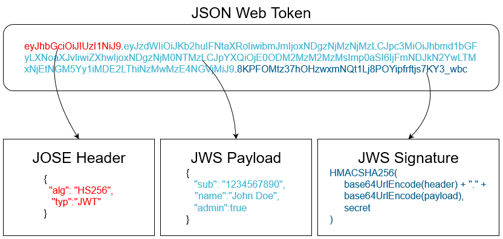

# 1.1 JWT Overview

## JWT in a nutshell

JSON Web Token (JWT) is an open standard (RFC 7519) that defines a compact and self-contained way for securely transmitting information between parties as a JSON object.

- Information can be **verified** and trusted because it is **digitally signed**.
  
- Used in **URL**, **POST** parameter, or an **HTTP header**.
  
- Used to **authenticate an API**.

## What is JWT Structure ?

JWT  looks like the following in its JWS compact serialization :

**JOSE Header:** Indicates to the receiver which type of signature algorithm to use for payload validation.

**JWS Payload:** Can contain any information but note that **the content is not encrypted**. So any information that you put in the token is readable by anyone who intercepts it. It also indicates the bearer standard properties for JWT Based Authentication:

- `iss` means the issuing entity, in this case, our authentication server 
- `iat` is the timestamp of creation of the JWT
- `sub` contains the technical identifier of the user
- `exp` contains the token expiration timestamp

**JWS Signature:** is a MAC (Message authentication code) produced with the header, payload and the secret key.

## What is a Bearer Token ?

The Bearer Token is the given name of a **JWT when it is used for authentication purpose**. 
The Bearer Token must at least have the "sub" and "exp" property defined in the JWT Payload. 
In the JWT authentication workflow, the bearer token becomes a signed temporary replacement for the login/password credentials.

## What are JWT benefits for authentication ?

JWT key benefit is to allow the possibility to **separate the Authentication logic from the Application Server**.

The Application servers become safer and faster by **delegating authentication to a third party server** that can be one of the following:

- A centralized in-house custom developed authentication server.
  
- A commercial product like LDAP capable of issuing JWTs.
    
- A completely external third-party authentication provider such as for example Auth0.

Another benefit is to make the application server completely stateless and no need to store password digests in application server database.
