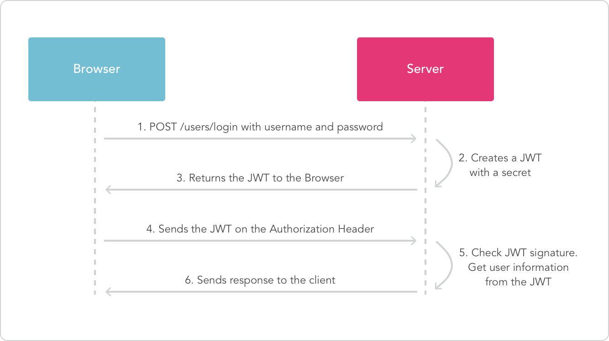

# 1.2 JWT Workflow

1. The user submits the username and password to an Authentication server.

2. The Authentication server validates the username and password combination and creates a Bearer Token: JWT token with a payload containing the user technical identifier, and an expiration timestamp.

3. The Authentication server then takes a secret key, and uses it to sign the Header plus Payload and sends it back to the user browser.

4. The browser takes the signed JWT and starts sending it with each HTTP request to our Application server.The signed JWT acts effectively as a temporary user credential, that replaces the permanent credential which is the username and password combination.